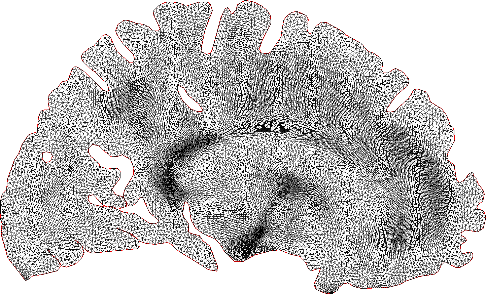

<div align="center"><h1> Tensor-field driven mesh adaptivity</br>for physics-informed statistical learning </h1></div>

<div align="center">

</div>

To run a script, be sure to have `FreeFem++` installed on your system. Then simply execute

```
FreeFem++ src/<script>.edp
```
